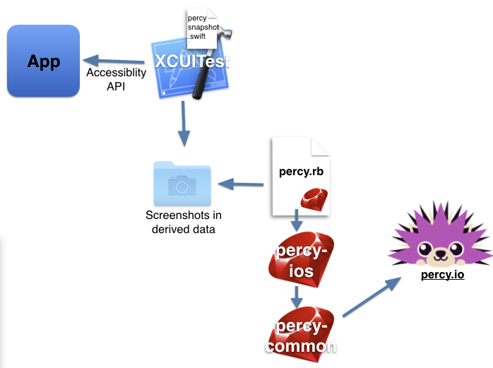
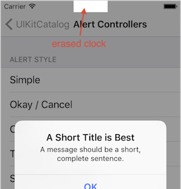

# percy-ios

[](https://travis-ci.org/percy/percy-ios)

[percy.io](percy.io) iOS support gem. The gem enables you to visual review your iPhone applications using [percy.io](percy.io) service.

Insert percySnapshot calls into your UI Test. Once the test runs from you continous integration the postprocessors script uploads images to [percy.io](percy.io). If there are pixel changes a human can review image differences from the github pull request.

## Architecture



percy-ios is a post processor that processes the derived data of the [UI tests](https://developer.apple.com/videos/play/wwdc2015/406/) introduced in XCode 7. The script extract screenshot marked with the the swift/objc percySnapshot helpers you add to UI Tests. Unlike percy's HTML mode, rendering is done by xcode UI Tests and we send bitmap images to the server. If you execute your UI Tests on different kind of devices in the simulator percy-ios will use (percy.io)[percy.io]-s responsive testing to upload separate images for each device for each test.


## Limitations

* multiple device support - some devices native resolution are halved when uploaded to percy to workaround widht limitaitons of percy.io. iPad will appear as 768px and iPad Pro will apear as 1024px
* clock area of the screenshot is erased. You can customize how it's erased in your percy.rb file:

  

  ```ruby
  percy.erase_rect(:clock) do |screenshot|
    w = CLOCK_WIDTH * screenshot.device.retina_multiplier
    h = STATUSBAR_HEIGHT * screenshot.device.retina_multiplier
    {x: screenshot.width / 2 - w / 2, y:0, width: w, height: h }
  end
  ```

## Instructions

see [UIKitCatalog-percy-sample](https://github.com/mfazekas/UIKitCatalog-percy-sample) for sample + step by step instructions
